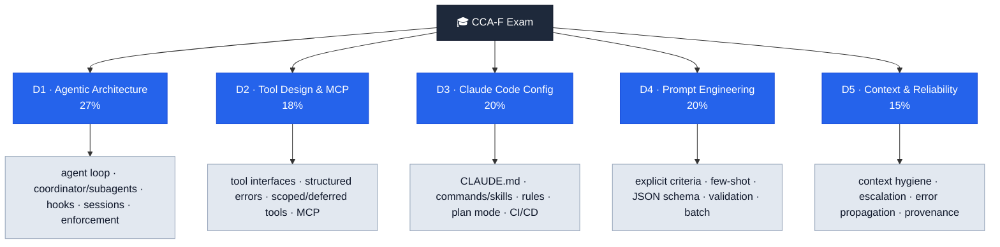

# Overview

> A study syllabus for the **Claude Certified Architect – Foundations (CCA-F)** exam — five domains, the decisions each one tests, and where to read more.

The CCA-F exam tests foundational knowledge across **Claude Code,
the Claude Agent SDK, the Claude API, and the Model Context Protocol
(MCP)**. Questions are scenario-based, drawn from real customer use
cases. The ideal candidate is a **solution architect** who builds
production applications with Claude.

## The five domains (and weights)

| # | Domain | Weight | Synthesis |
|---|--------|--------|-----------|
| 1 | Agentic Architecture & Orchestration | **27%** | [[domain-1-agentic-architecture]] |
| 2 | Tool Design & MCP Integration | **18%** | [[domain-2-tool-design-mcp]] |
| 3 | Claude Code Configuration & Workflows | **20%** | [[domain-3-claude-code-config]] |
| 4 | Prompt Engineering & Structured Output | **20%** | [[domain-4-prompt-engineering]] |
| 5 | Context Management & Reliability | **15%** | [[domain-5-context-reliability]] |

Domains 1, 3, and 4 are the heaviest — together ~67% of the exam.

## Domain map

(Switch this page to **reading view** to see the map. Each domain's full
page list is in its folder hub — see the links in the table above.)

## The six exam scenarios

Questions are framed inside these recurring scenarios:

1. **Customer Support Resolution Agent** (Agent SDK; MCP tools like
   `get_customer`, `lookup_order`, `process_refund`,
   `escalate_to_human`; 80%+ first-contact resolution).
2. **Code Generation with Claude Code** (slash commands, CLAUDE.md,
   plan mode vs direct execution).
3. **Multi-Agent Research System** (coordinator + search/analyze/
   synthesize/report subagents; cited reports).
4. **Developer Productivity with Claude** (explore codebases;
   built-in tools `Read/Write/Bash/Grep/Glob`; MCP servers).
5. **Claude Code for CI/CD** (automated review, test generation, PR
   feedback; minimize false positives).
6. **Structured Data Extraction** (unstructured docs → JSON-schema-
   validated output; graceful edge cases).

## How this wiki is organized

Folders mirror the exam — study by **domain**:

- **`start-here/`** — cross-cutting "how to think" pages (read in
  numbered order): this overview, [[01-first-principles]],
  [[02-root-cause-decision-tree]], [[03-never-right-answers]], then two
  focused question pages.
- **`domain-1…5/`** — one folder per exam domain, each a self-contained
  study unit: its **hub** (`00-domain-N-*`, sorts first) + concept pages
  + "X vs Y" decision pages.
- **`reference/`** — the products/APIs themselves ([[claude-agent-sdk]],
  [[claude-code]], [[model-context-protocol]], [[message-batches-api]],
  [[task-tool]]).

Navigate from [[index]]; change history in [[log]].

## Recurring exam meta-patterns

A handful of "wrong answers" repeat across every domain. If an answer
choice says any of these, it is almost always wrong:

- "Add stronger prompt wording" / "tell Claude to be more careful"
  when the real fix is a **programmatic gate / hook / explicit criteria**.
- "Use model self-reported confidence" to gate a decision.
- "Use a bigger context window" to fix an **organization** problem.
- "Fine-tune the model" as a first fix for tool selection or format.
- "Escalate because sentiment is negative."
- Treating **"tool failed"** and **"found nothing"** as the same.

## What's strong vs weak

- **Strong:** all five domains have full synthesis coverage; the
  high-frequency decision pairs have comparison pages; the
  practice-exam mistake patterns are distilled into
  [[02-root-cause-decision-tree]] and [[03-never-right-answers]].
- **Weak / TODO:** the older image-only deck [[ccaf.meta|ccaf]] is still not
  text-ingested (poppler is now installed, so it can be — deferred as
  it's largely diagrams duplicating the notes).

## Sources
- [[CCA-F Notes.meta|CCA-F Notes]] — primary; structured notes for all 5 domains + the 6 scenarios.
- [[CCA-F Practice Exam (v1).meta|CCA-F Practice Exam (v1)]] — mistake patterns & the root-cause decision tree.
- [[CCA-F Cheatsheet.meta|CCA-F Cheatsheet]] — condensed per-domain summary.
- [[CCA-F Exam Notes]] — earlier markdown notes (superseded by the PDF).
- [[ccaf.meta|ccaf]] — older companion deck (not yet text-ingested).

## Continue reading
- **The axioms** → [[01-first-principles]]
- **The procedure** → [[02-root-cause-decision-tree]]
- **Start Domain 1** → [[domain-1-agentic-architecture]]
